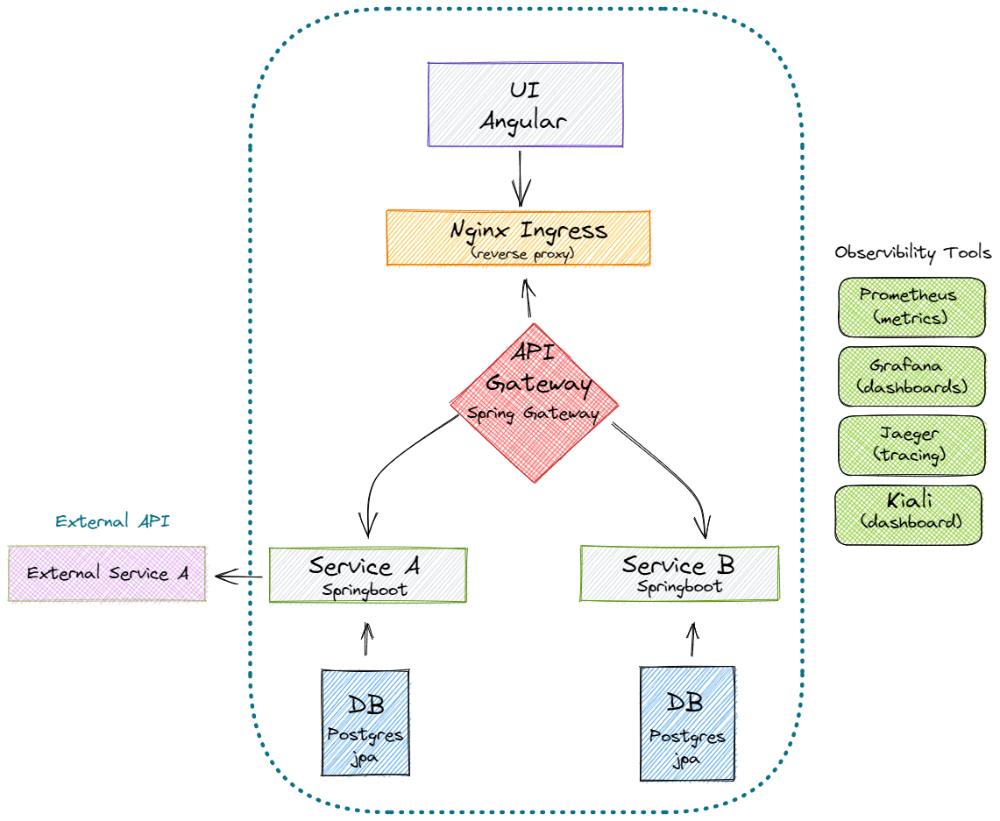

WIP readme

# Ecosystem Playground Design

<p align="center">
    
</p>

# How to Deploy:

## install nginx ingress :
```
kubectl apply -f https://raw.githubusercontent.com/kubernetes/ingress-nginx/controller-v0.48.1/deploy/static/provider/cloud/deploy.yaml
```

## build the project using Skaffold : 
```
skaffold run
```


This project will be used to incrementally build a fully fledged microservice ecosystem.
